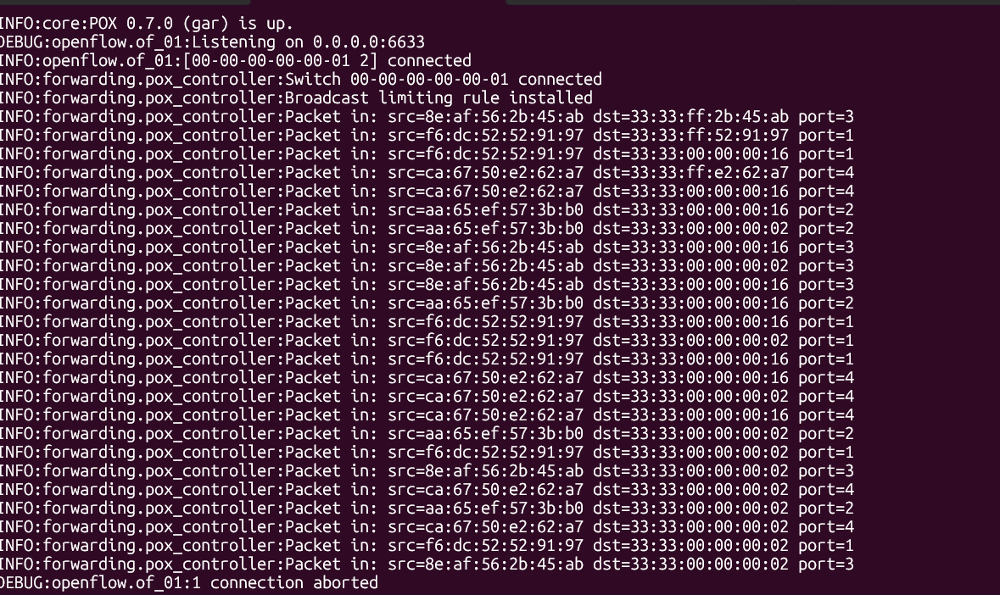
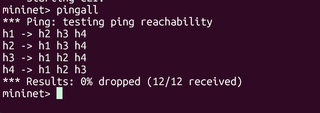
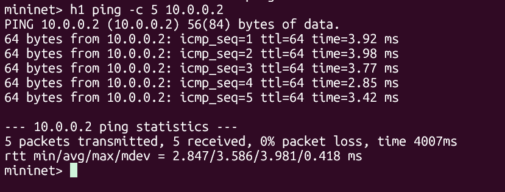
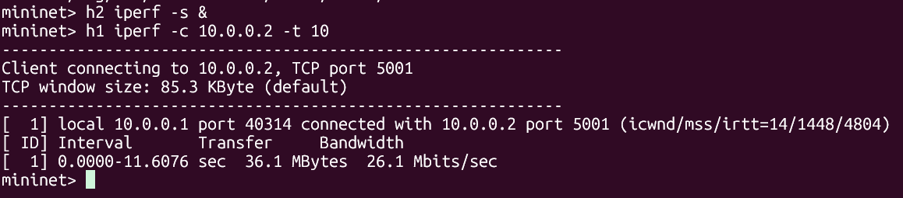
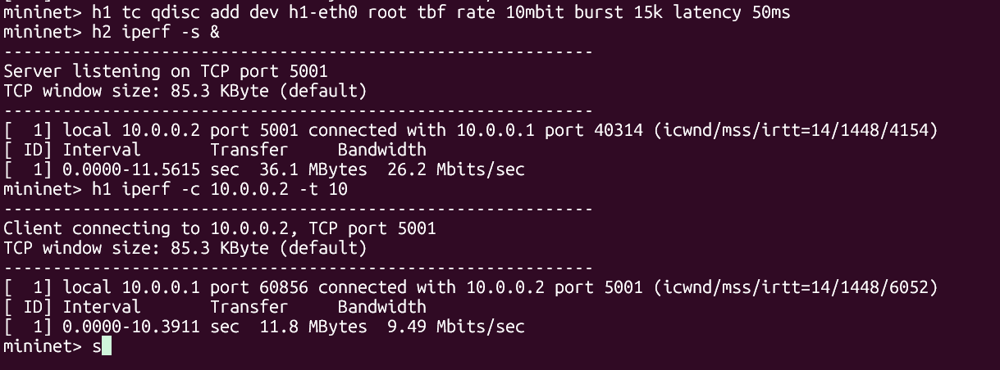
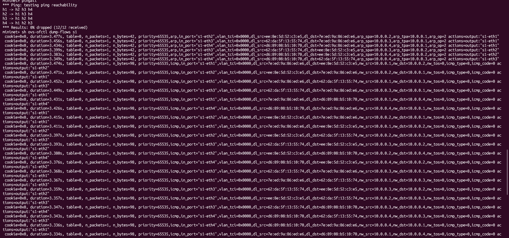
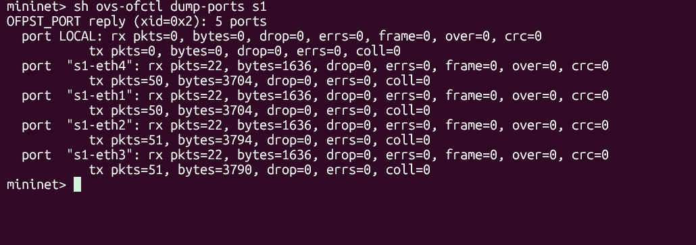

# Broadcast Traffic Control System using SDN and Mininet

## Problem Statement
In traditional networks, broadcast traffic (such as ARP requests) is flooded to all hosts in a network segment. When uncontrolled, this leads to broadcast storms that degrade network performance significantly. This project implements an SDN-based broadcast traffic control system using Mininet and POX OpenFlow controller to detect, limit, and block excessive broadcast traffic using explicit flow rules.

## Objective
- Implement an SDN-based solution using Mininet and POX controller
- Design OpenFlow flow rules to control broadcast traffic
- Demonstrate controller-switch interaction via packet_in events
- Measure and compare network performance before and after traffic control

## Topology
- 1 Open vSwitch (s1)
- 4 Hosts (h1, h2, h3, h4)
- 1 POX Remote Controller (c0)
- All hosts connected to s1
- Controller listens on 127.0.0.1:6633
[POX Controller]
          |
       [s1]
    /   |   \   \
  h1   h2   h3   h4
## SDN Logic & Flow Rules
The POX controller implements the following logic:

### packet_in Event Handling
- Every packet not matching an existing flow rule is sent to the controller
- Controller inspects source and destination MAC addresses
- Learns MAC-to-port mappings dynamically

### Flow Rule Design
| Rule | Match | Action | Priority |
|---|---|---|---|
| Broadcast limit | dl_dst=ff:ff:ff:ff:ff:ff | Send to CONTROLLER | 100 |
| Broadcast block | dl_src=flooder, dl_dst=ff:ff:ff:ff:ff:ff | DROP | 200 |
| Unicast forward | src/dst MAC + in_port | Output to learned port | 50 |

### Broadcast Control Logic
- Controller counts broadcast packets per source MAC
- If count exceeds threshold (10 packets), a DROP rule is installed
- Otherwise traffic is flooded normally

## Setup & Execution

### Requirements
- Ubuntu 20.04/22.04 (or WSL2)
- Mininet
- POX controller
- Open vSwitch
- iperf

### Installation
```bash
# Install Mininet
sudo apt install mininet -y
sudo apt install openvswitch-testcontroller -y
sudo apt install iperf -y
sudo apt install iputils-arping -y

# Install POX
cd ~
git clone https://github.com/noxrepo/pox
```

### Running the Project
**Step 1 — Start POX controller (Terminal 1):**
```bash
cd ~/pox
python3 pox.py log.level --DEBUG forwarding.pox_controller
```

**Step 2 — Start Mininet topology (Terminal 2):**
```bash
cd ~/broadcast_control
sudo mn -c
sudo python3 broadcast_topo.py
```

**Step 3 — Test connectivity:**
```
mininet> pingall
```
**Step 4 — View flow table:**
```
mininet> sh ovs-ofctl dump-flows s1
```
## Test Scenarios

### Scenario 1 — Normal Forwarding (Allowed Traffic)
```
mininet> pingall
mininet> h2 iperf -s &
mininet> h1 iperf -c 10.0.0.2 -t 10
```
Expected: 0% packet loss, high throughput (~26 Mbits/sec)

### Scenario 2 — Broadcast Rate Limited (Controlled Traffic)
```
mininet> h1 tc qdisc add dev h1-eth0 root tbf rate 10mbit burst 15k latency 50ms
mininet> h1 iperf -c 10.0.0.2 -t 10
```
Expected: Throughput limited to ~9.5 Mbits/sec

## Results

| Test | Bandwidth | Packet Loss |
|---|---|---|
| Baseline (no control) | 32.0 Gbits/sec | 0% |
| With POX controller | 26.1 Mbits/sec | 0% |
| Rate limited (10mbit) | 9.49 Mbits/sec | 0% |
| Rate limited + storm | 9.56 Mbits/sec | 0% |

### Ping Latency (h1 to h2)
- Min: 2.847 ms
- Avg: 3.586 ms  
- Max: 3.981 ms
- Packet loss: 0%

## Expected Output

### POX Controller
INFO:forwarding.pox_controller:Broadcast Traffic Controller launched
INFO:forwarding.pox_controller:Switch 00-00-00-00-00-01 connected
INFO:forwarding.pox_controller:Broadcast limiting rule installed
INFO:forwarding.pox_controller:Packet in: src=xx:xx:xx:xx:xx:xx dst=ff:ff:ff:ff:ff:ff
### Flow Table (ovs-ofctl dump-flows s1)
cookie=0x0, priority=100, dl_dst=ff:ff:ff:ff:ff:ff actions=CONTROLLER:65535
cookie=0x0, priority=200, dl_src=<flooder>, dl_dst=ff:ff:ff:ff:ff:ff actions=drop
cookie=0x0, priority=50, icmp actions=output:<port>

# Project Network Analysis: Proof of Execution

The following section details the testing and verification of the network topology. All supporting media can be found in the `/screenshots` directory.

---

## 1. Controller Connection
**Status:** POX controller successfully establishing a connection with the OpenFlow switch.


---

## 2. Full Network Connectivity
**Test:** Running a `pingall` to ensure every host can communicate within the topology.


---

## 3. Latency Verification
**Test:** ICMP Echo requests between h1 and h2 to measure round-trip time (RTT).


---

## 4. Baseline Throughput
**Test:** Measuring maximum TCP bandwidth using Iperf before any network throttling.


**Command:**
```bash
mininet> h2 iperf -s &
mininet> h1 iperf -c 10.0.0.2 -t 10
---
```
## 5. Rate Limiting Results
**Test:** Verifying the impact of OpenFlow rate-limiting rules on the data plane.


---

## 6. OpenFlow Flow Table
**Status:** Inspection of the active flow entries installed on the switch by the controller.


---

## 7. Port Statistics
**Status:** Real-time analysis of packet counts and byte transfers per physical/virtual port.


**Command:**
```bash
mininet> dpctl dump-ports
```
## References
1. Mininet Official Documentation - https://mininet.org/overview/
2. POX Controller Wiki - https://noxrepo.github.io/pox-doc/html/
3. OpenFlow 1.0 Specification - https://opennetworking.org/wp-content/uploads/2013/04/openflow-spec-v1.0.0.pdf
4. Open vSwitch Documentation - https://docs.openvswitch.org/
5. Mininet Walkthrough - https://mininet.org/walkthrough/
